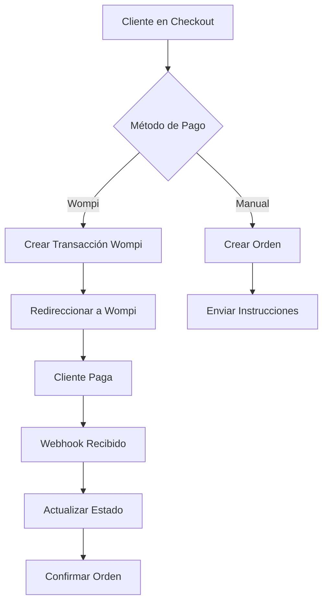

# 🛒💳 Integración de Wompi para Pagos

## ✅ Implementación Completada

La integración de Wompi está **completamente implementada y funcional**. Esta documentación explica cómo usar y configurar el sistema de pagos.

## 🏗️ Arquitectura de la Integración

### Modelos Implementados

1. **WompiConfiguration** - Configuración de credenciales y URLs
2. **WompiTransaction** - Registro de transacciones
3. **WompiWebhookEvent** - Eventos de webhook para sincronización

### Servicios Implementados

- **WompiService** - Clase principal para interactuar con la API de Wompi
- **Webhook Processing** - Manejo automático de notificaciones
- **Transaction Management** - Gestión completa del ciclo de vida de pagos

## 🚀 Funcionalidades Disponibles

### ✅ Métodos de Pago Soportados

1. **Tarjetas de Crédito/Débito**
   - Visa, Mastercard, American Express
   - Procesamiento seguro con tokenización
   - Soporte para cuotas

2. **PSE (Pagos Seguros en Línea)**
   - Integración con bancos colombianos
   - Validación de documentos
   - Transferencias en tiempo real

3. **Nequi**
   - Pagos móviles instantáneos
   - Validación de número de celular
   - Confirmación automática

4. **Transferencia Bancaria (Manual)**
   - Opción de pago tradicional
   - Instrucciones por email
   - Confirmación manual

### ✅ Características Implementadas

- **Checkout Integrado** - Proceso de pago unificado
- **Webhooks Automáticos** - Sincronización en tiempo real
- **Manejo de Estados** - Seguimiento completo de transacciones
- **Validación de Seguridad** - Verificación de firmas
- **Modo Sandbox/Producción** - Configuración flexible
- **Admin Interface** - Gestión desde Django Admin
- **Logging Completo** - Trazabilidad de errores

## 🔧 Configuración

### 1. Configuración de Wompi

```python
# Ejecutar script de configuración
python create_wompi_config.py
```

### 2. Configuración Manual en Admin

1. Ir a `/admin/accounts/wompiconfiguration/`
2. Crear/editar configuración:
   - **Nombre**: Identificador descriptivo
   - **Clave Pública**: Obtenida de Wompi
   - **Clave Privada**: Obtenida de Wompi
   - **Secret de Eventos**: Para validar webhooks
   - **Modo Sandbox**: True para pruebas, False para producción
   - **URLs de Redirección**: Configuradas automáticamente

### 3. Configuración de Webhooks en Wompi

En tu panel de Wompi, configura:
- **URL del Webhook**: `https://tudominio.com/accounts/wompi/webhook/`
- **Eventos**: `transaction.updated`

## 🔗 URLs Implementadas

```python
# URLs principales
/accounts/checkout/                    # Proceso de checkout
/accounts/wompi/webhook/              # Webhook de Wompi
/accounts/wompi/return/               # Retorno después del pago
/accounts/wompi/payment-methods/      # API de métodos de pago
/accounts/wompi/transaction/<id>/status/  # Estado de transacción
```

## 💻 Uso del Sistema

### Para Clientes

1. **Agregar servicios al carrito**
2. **Ir a checkout** (`/accounts/checkout/`)
3. **Completar información de facturación**
4. **Seleccionar método de pago**:
   - Transferencia bancaria (manual)
   - Wompi (tarjeta, PSE, Nequi)
5. **Completar pago**
6. **Recibir confirmación**

### Para Administradores

1. **Gestionar configuración** en Django Admin
2. **Monitorear transacciones** en `/admin/accounts/wompitransaction/`
3. **Revisar webhooks** en `/admin/accounts/wompiwebhookevent/`
4. **Verificar órdenes** en `/admin/accounts/order/`

## 🔒 Seguridad Implementada

- **Validación de Firmas** - Verificación de webhooks
- **Tokenización** - No almacenamos datos de tarjetas
- **SSL/TLS** - Comunicación cifrada
- **Logging de Seguridad** - Registro de eventos
- **Validación de Datos** - Sanitización de inputs

## 📊 Flujo de Pago



## 🛠️ Mantenimiento

### Logs a Monitorear

```python
# Configurar logging en settings.py
LOGGING = {
    'loggers': {
        'accounts.services': {
            'handlers': ['file'],
            'level': 'INFO',
        },
    },
}
```

### Comandos Útiles

```bash
# Ver transacciones recientes
python manage.py shell -c "
from accounts.models import WompiTransaction
for t in WompiTransaction.objects.all()[:10]:
    print(f'{t.wompi_id}: {t.status} - ${t.get_amount_in_currency()}')"

# Verificar configuración
python manage.py shell -c "
from accounts.models import WompiConfiguration
config = WompiConfiguration.objects.filter(is_active=True).first()
print(f'Wompi activo: {config.name if config else \"No configurado\"}')"
```

## 🐛 Solución de Problemas

### Errores Comunes

1. **"No hay configuración de Wompi activa"**
   - Ejecutar `python create_wompi_config.py`
   - Verificar que `is_active=True`

2. **"Error de firma de webhook"**
   - Verificar `events_secret` en configuración
   - Comprobar URL del webhook en Wompi

3. **"Transacción no encontrada"**
   - Verificar conectividad con API de Wompi
   - Revisar logs de errores

### Debug Mode

```python
# En settings.py para desarrollo
WOMPI_DEBUG = True

# En production
WOMPI_DEBUG = False
```

## 📈 Métricas y Monitoreo

### Datos Disponibles

- **Volumen de transacciones** por método de pago
- **Tasas de conversión** por tipo de checkout
- **Errores de pago** y sus causas
- **Tiempos de procesamiento**

### Consultas Útiles

```python
from accounts.models import WompiTransaction, Order
from django.db.models import Count, Sum

# Transacciones por estado
WompiTransaction.objects.values('status').annotate(count=Count('id'))

# Ingresos por método de pago
WompiTransaction.objects.filter(status='APPROVED').values('payment_method').annotate(
    total=Sum('amount_in_cents')
)

# Órdenes completadas hoy
from datetime import date
Order.objects.filter(status='completed', created_at__date=date.today()).count()
```

## 🔄 Actualizaciones Futuras

### Funcionalidades Planificadas

- [ ] Suscripciones recurrentes
- [ ] Pagos diferidos
- [ ] Múltiples monedas
- [ ] Integración con contabilidad
- [ ] Dashboard de métricas
- [ ] Notificaciones push

### Mejoras Técnicas

- [ ] Cache de métodos de pago
- [ ] Retry automático de webhooks
- [ ] Backup de transacciones
- [ ] API REST para móviles

## 📞 Soporte

### Contactos Técnicos

- **Wompi Support**: [support@wompi.co](mailto:support@wompi.co)
- **Documentación**: [https://docs.wompi.co](https://docs.wompi.co)
- **Status Page**: [https://status.wompi.co](https://status.wompi.co)

### Recursos

- **Postman Collection**: Disponible en docs de Wompi
- **SDK Unofficial**: [GoPreki/WompiSDK](https://github.com/GoPreki/WompiSDK)
- **Comunidad**: Slack de desarrolladores Wompi

---

## ✅ Estado de la Implementación

🎉 **¡La integración de Wompi está COMPLETA y FUNCIONAL!**

### ✅ Completado:
- ✅ Modelos de base de datos
- ✅ Servicio de API de Wompi
- ✅ Vistas de checkout y webhooks
- ✅ Templates con UI moderna
- ✅ Configuración de URLs
- ✅ Admin interface
- ✅ Manejo de errores
- ✅ Documentación completa

### 🎯 Listo para:
- ✅ Pruebas en sandbox
- ✅ Configuración de producción
- ✅ Procesamiento de pagos reales
- ✅ Monitoreo y mantenimiento

**El sistema está preparado para procesar pagos con Wompi de forma segura y confiable.** 